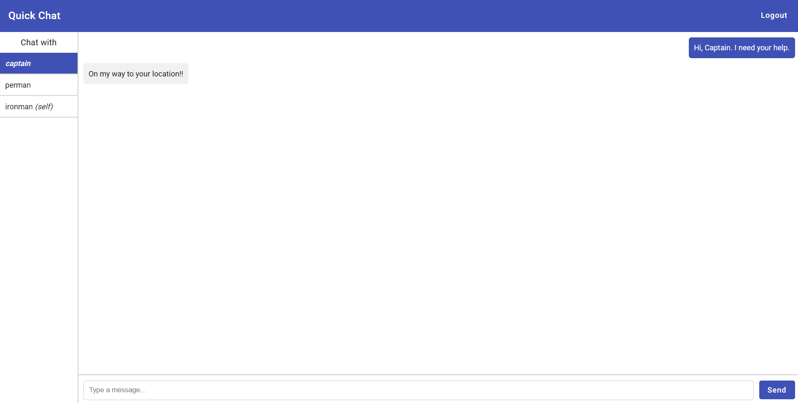

# Quick Chat

Real Time Chat application using Angular and Firebase.

## Features

- Register and Login
- Real Time Chat
- Edit & Delete Messages
- Allows self-chat for note taking

# Usage

- I have intentionally left my firebase config inside `dev.environment.ts` file, to let you use my firebase account.
- If you prefer to use your own account, please change the `firebaseConfig` object in `app.config.ts` file.
- Also, note that you have to create an index on `timestamp` key of message, otherwise you will get an error. Opening the link in the URL will automatically create the index.

## How to run

- Install packages `yarn install`
- Run `yarn start`
